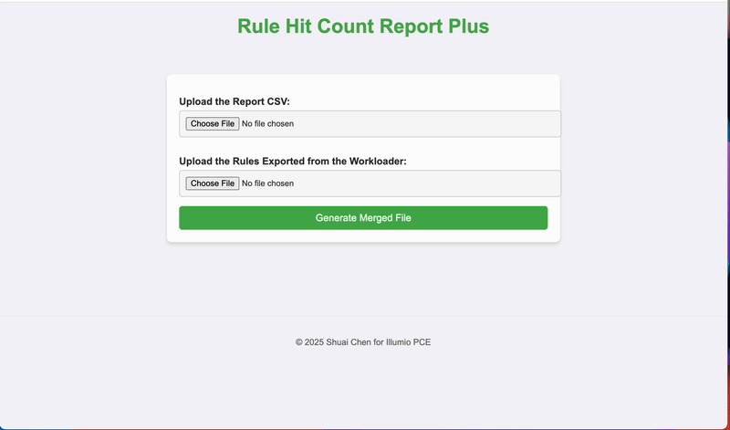
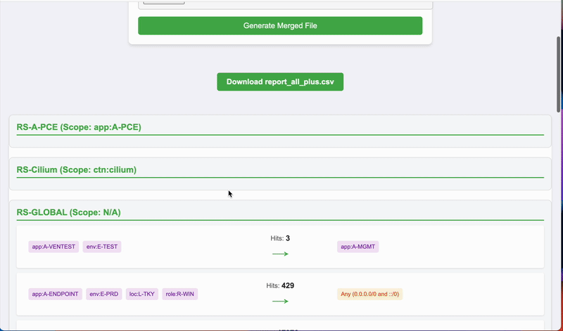

# Rule Hit Counter Report Plus - Web Version

https://rhcp.cshuai.com

A web-based visualization tool that enhances rule hit counter reports by providing an intuitive graphical interface to display rule information and hit counts.

## Overview
This web application is an extension of the CLI version of Rule Hit Counter Report Plus. It provides a visual representation of rule relationships and hit counts, making it easier to understand rule patterns and traffic flows.

## Usage Steps
1. Export rules using Workloader:
   ```bash
   ./workloader rule-export
   ```

2. Generate a rule hit counter report from your PCE

3. Access the web interface and upload both files:
   - The rule hit counter report CSV
   - The exported rules CSV

4. The tool will generate:
   - A visual representation of your rules
   - A downloadable enhanced CSV file

## Visualization Features

### Rule Display Elements
- **Extra-Scope Label**: Indicates rules with unscoped consumers
- **All Workloads**: Shows when a rule applies to all workloads (source or destination)
- **Labels**: Displays role labels (R:) and location labels (L:)
- **Label Groups**: Shows groups of labels, displayed in brackets []
- **Exclusions**: Indicates excluded labels or groups (shown with strikethrough)
- **Hit Counts**: Displays the number of times each rule was matched

### Data Fields Used
The visualization is based on the following CSV fields:
- `unscoped_consumers`: Determines Extra-Scope label display
- `src_all_workloads`, `dst_all_workloads`: Controls All Workloads label display
- `src_labels`, `dst_labels`: Shows regular labels
- `src_labels_exclusions`, `dst_labels_exclusions`: Shows excluded labels
- `src_label_groups`, `dst_label_groups`: Shows label groups
- `src_label_groups_exclusions`, `dst_label_groups_exclusions`: Shows excluded label groups
- `src_iplists`, `dst_iplists`: Displays IP list information
- `rule_hit_count`: Shows the number of hits for each rule

## Features
- Interactive web interface
- Visual representation of rule relationships
- Automatic CSV enhancement
- Support for all rule types and labels
- Clear visualization of rule patterns and traffic flows

## Limitations
- Override deny rules are not currently supported (same limitation as CLI version)
- Browser-based visualization requires modern web browser support
- Large rule sets may require longer loading times

## Related
For CLI version functionality, please refer to the [CLI tool documentation](https://github.com/csmanutd/rhc-plus).

## Demo

### Part 1: File Upload and Processing
This part demonstrates how to upload the rule hit counter report and exported rules files:


### Part 2: Download Results
This part shows how to download the generated csv file:

